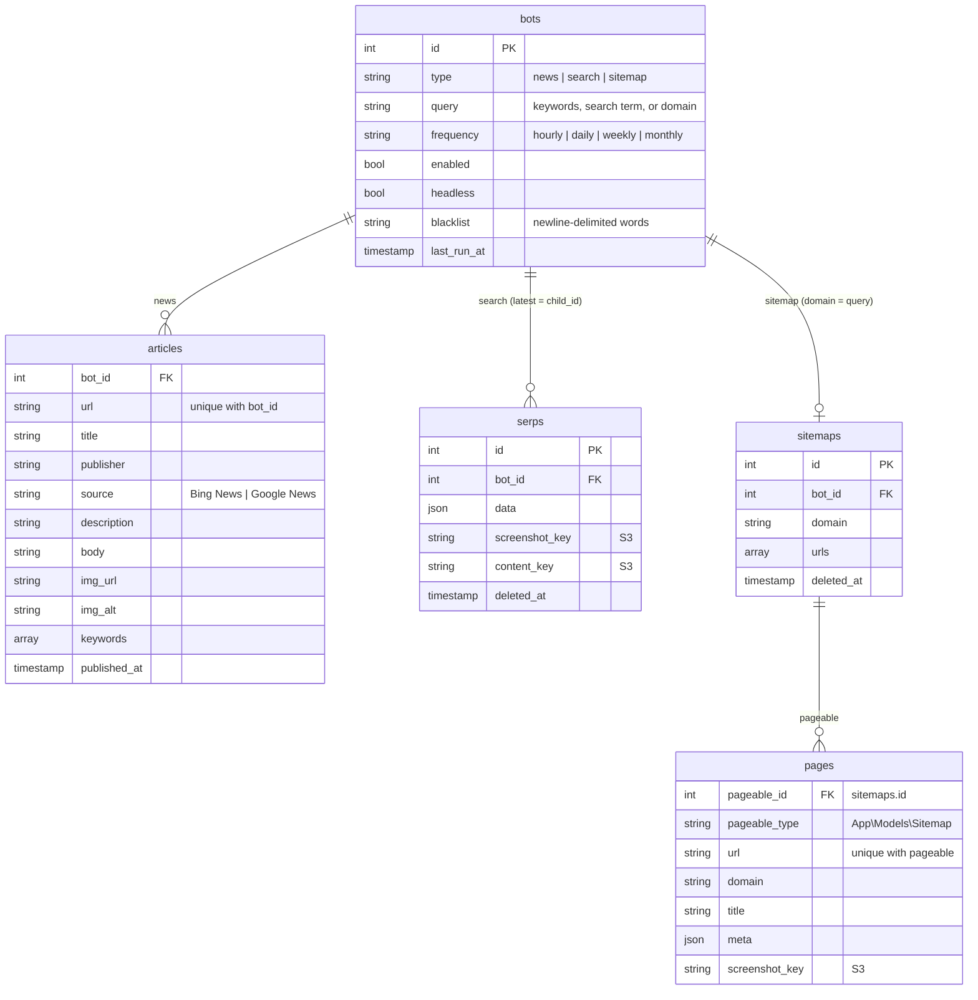
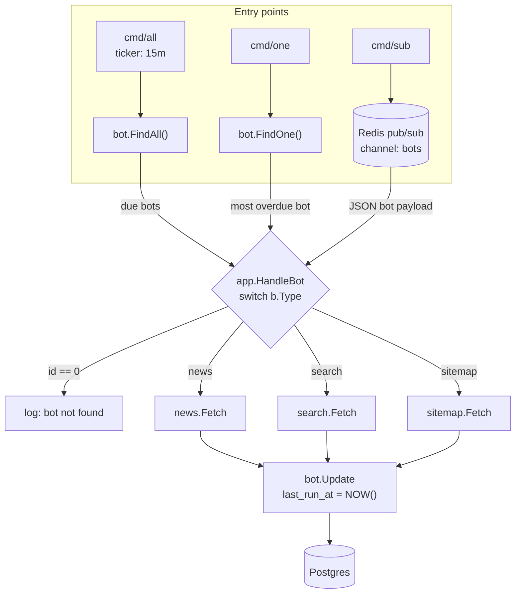
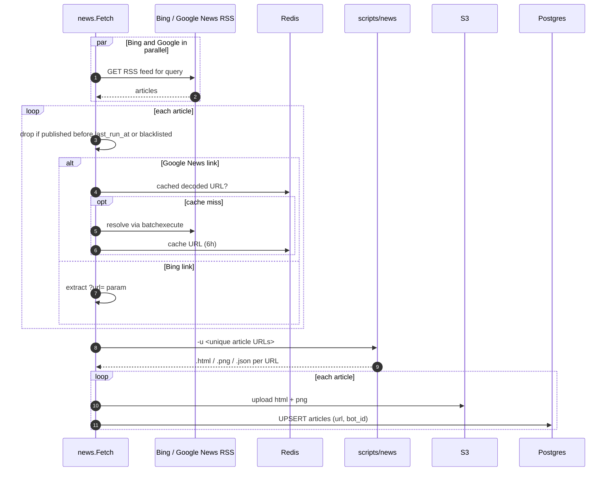
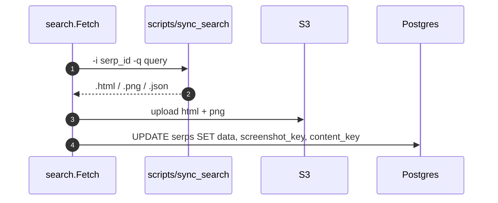
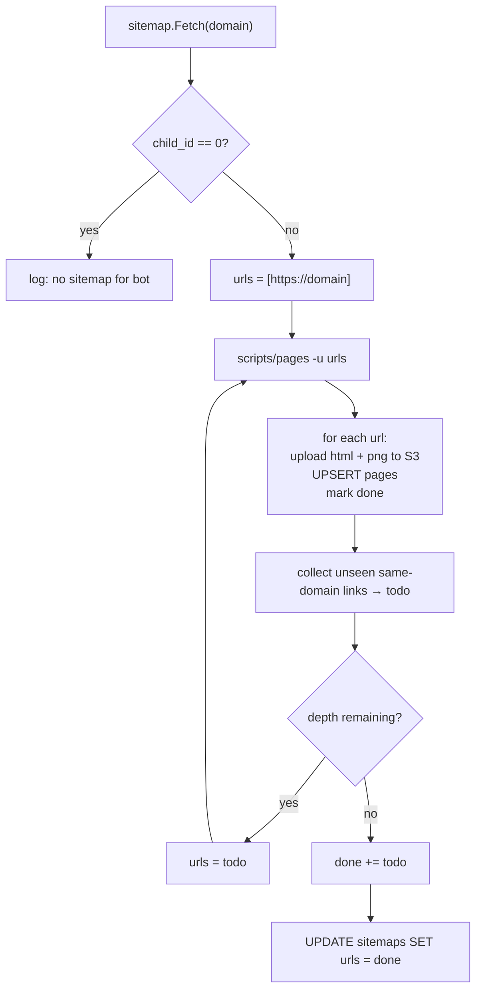

## Model

A **bot** is a scheduled job of one of three types (`news`, `search`, `sitemap`). A bot is _due_ when it is enabled and
`last_run_at + frequency <= NOW()` (or it has never run). Search and sitemap bots write into a child record (`child_id`),
resolved at query time in `internal/bot/repo.go`.

## Workflows

There are three entry points, all of which funnel into `app.HandleBot`:

| Command    | Source         | Behavior                                                         |
|------------|----------------|------------------------------------------------------------------|
| `make all` | `cmd/all`      | Works every due bot now, then again every 15 minutes             |
| `make one` | `cmd/one`      | Works the single most overdue bot and exits                      |
| `make sub` | `cmd/sub`      | Subscribes to the Redis `bots` channel and works each bot pushed |

Each fetcher shells out to a Python/Playwright script in `scripts/`, which writes `<name>.html`, `<name>.png`, and
`<name>.json` under `.storage/`. `play.HandleFiles` then uploads the HTML and screenshot to S3 and returns the parsed
JSON for persistence.

### News

### Search

### Sitemap

A breadth-first crawl of same-domain links starting at `https://<query>`, bounded by `SITEMAP_DEPTH`.

